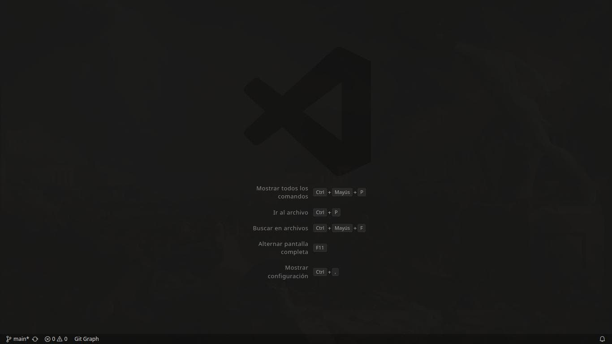
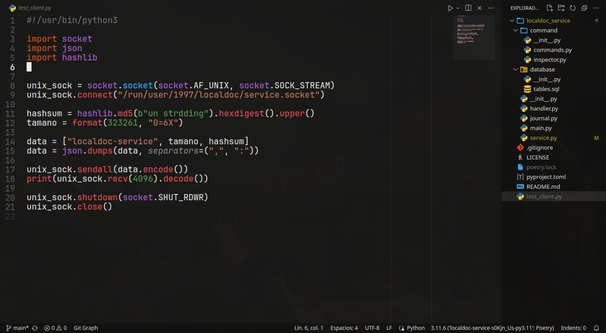
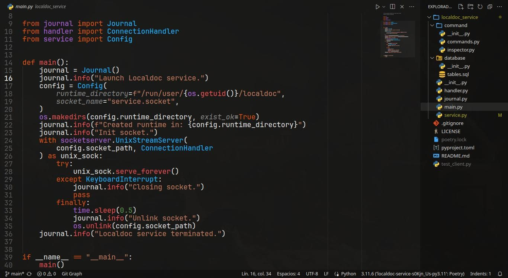
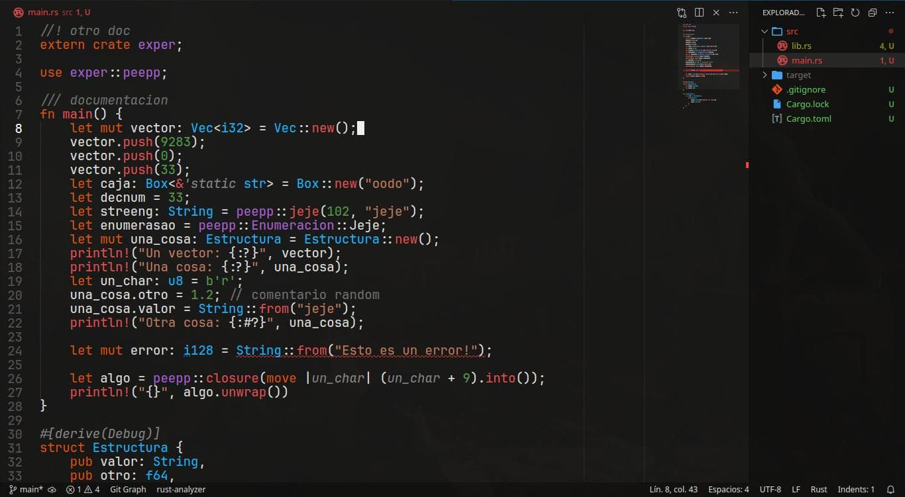

# Non Arbitrary Colors Theme for VSCode

> Theme based on: [Monokai Night Theme](https://github.com/fabiospampinato/vscode-monokai-night.git) of *@Fabio Spampinato*.

## Theme is target and tested for next languages (for now):

- **Python**
- **Rust**
- **TOML**
- **JSON**

## Color semantic palette

-  `#ab60d6`: namespaces (modules, enums)
-  `#1ab2ff`: classes, structs and types
-  `#e54e4e`: imperative instructions (functions, methods, refs, deref, unpacking)
-  `#858585`: parameters and unused variables (with dashed underline)
-  `#dd500e`: keywords language
-  `#707070`: comments, documentation strings, directives and decorators
-  `#529a45`: numbers (integers, floats and chars)
-  `#c0795d`: strings

## Random screen examples

### **VSCode splash screen**

### **Python code example**

### **Rust code example**

> [!NOTE]
> Look at `vscode-settings` branch to get the editor JSON User Settings.
