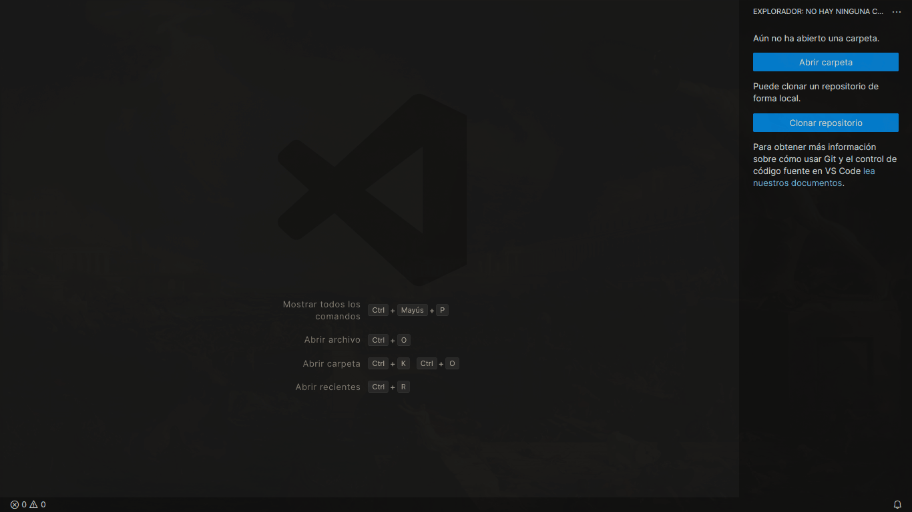
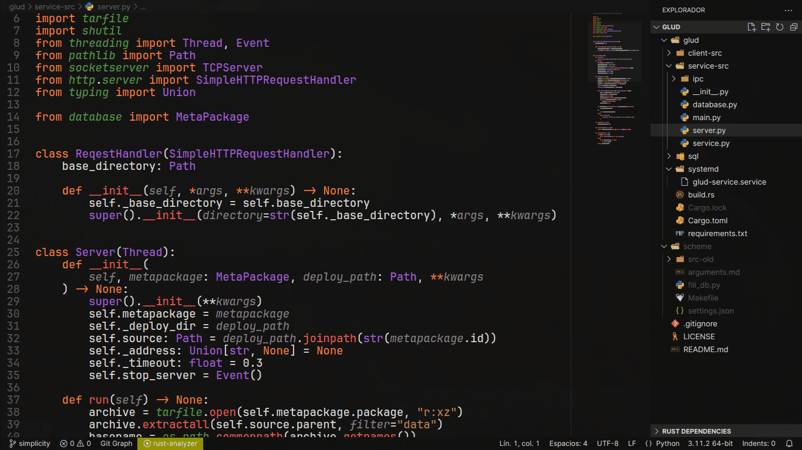
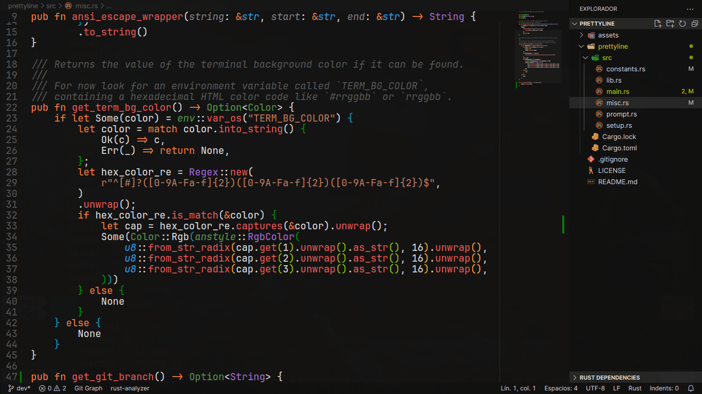
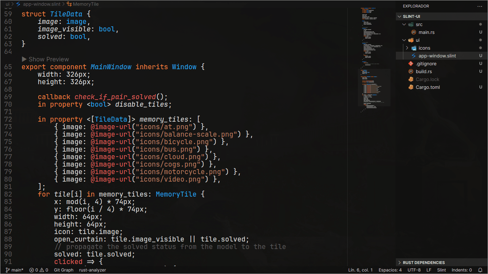
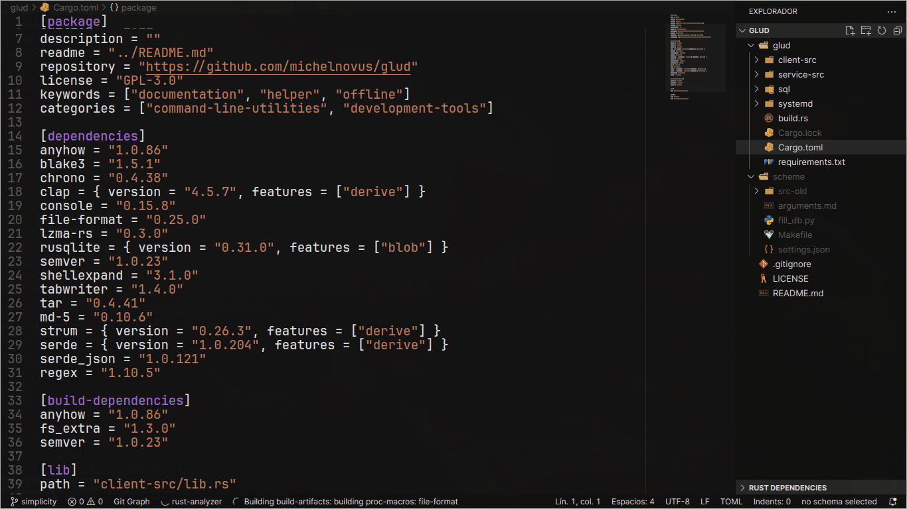
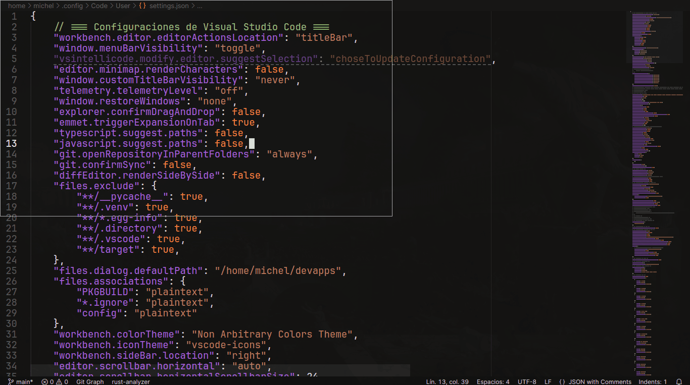
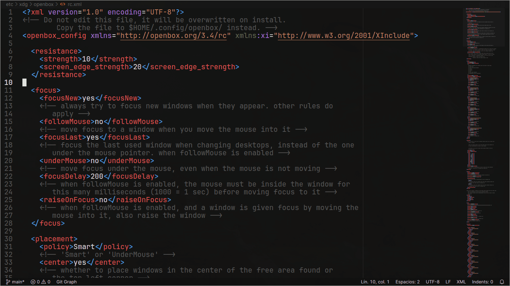

# Non Arbitrary Colors Theme for VSCode

> Theme based on: [Monokai Night Theme](https://github.com/fabiospampinato/vscode-monokai-night.git) of *@Fabio Spampinato*.

## Theme is target and tested for next languages and markup text (for now):

- **Python**
- **Rust**
- **Shell**
- **Slint**
- **JSON**
- **TOML**
- **XML**

## Color semantic palette

-  `#529a45`: namespaces (modules, enums)
-  `#a85de0`: classes, structs and types
-  `#21a9ff`: builtin types
-  `#ef5555`: imperative instructions (functions, methods)
-  `#858585`: parameters and unused variables (with dashed underline)
-  `#ff7d39`: keywords language and refs, deref, unpacking symbols
-  `#555555`: comments, documentation strings
-  `#ef5555`: derives and decorators
-  `#e0e0e0`: numbers (integers, floats and chars)
-  `#c0795d`: strings
-  `#e0e0e0`: main foreground
-  `#121212`: main background

> [!NOTE]
> Look at `vscode-settings` branch to get the editor JSON User Settings.

## Random screen examples

### **VSCode splash screen**

### **Python code example**

### **Rust code example**

### **Bash code example**

### **Slint code example**

### **TOML code example**

### **JSON example**

### **XML example**

